# Sevenify
## Deskripsi Aplikasi
Aplikasi Sevenify merupakan perangkat lunak pemutar musik berbasis web. Aplikasi ini dilengkapi dengan fitur pemutar musik, pencarian lagu, album, serta playlist. Tidak hanya mendengarkan musik, pengguna juga dapat mengunggah musik maupun membuat album dan playlist-nya sendiri. Admin dapat melakukan modifikasi data musik, album, playlist, serta memodifikasi akun pada aplikasi. Dengan desain tampilan yang sederhana, aplikasi ini diharapkan dapat digunakan dengan mudah oleh pengguna. Mari nikmati musik bersama Sevenify, _Feel the Beat Live the Melody!_

## Daftar _Requirement_
* HTML
* CSS
* JavaScript
* PHP
* MySQL/MariaDB

## Cara Instalasi
1. Pastikan _requirements_ sudah terinstall pada perangkat Anda
2. Buka terminal
3. Lakukan clone repository ini
4. Pindah ke directory repository
5. Jalankan server MySQL/MariaBD
6. Masuk ke MySQL untuk membangun database : `mysql -u username -p -h host` 
Kemudian masukkan query yang ada di migrations\seed.sql 
7. Dapat juga dilakukan migrasi database dengan menjalankan perintah mysql -u username nama_database < seed.sql pada terminal.  
8. Copy .env.example dan rename menjadi .env. Sesuaikan isinya dengan spesifikasi database yang sudah ada.

## Cara Menjalankan Server
### Melalui Terminal
1. Pastikan server MySQL/MariaDB berjalan
2. Pindah ke direktori src : `cd src`
3. Jalankan perintah `php -S localhost:port -c ../php.ini` 
4. Buka browser dan masuk ke alamat http://localhost:port/  
Masukkan port yang sesuai dengan post yang dipakai untuk menjalankan server

## _Screenshot_ Tampilan Aplikasi
- Halaman Register
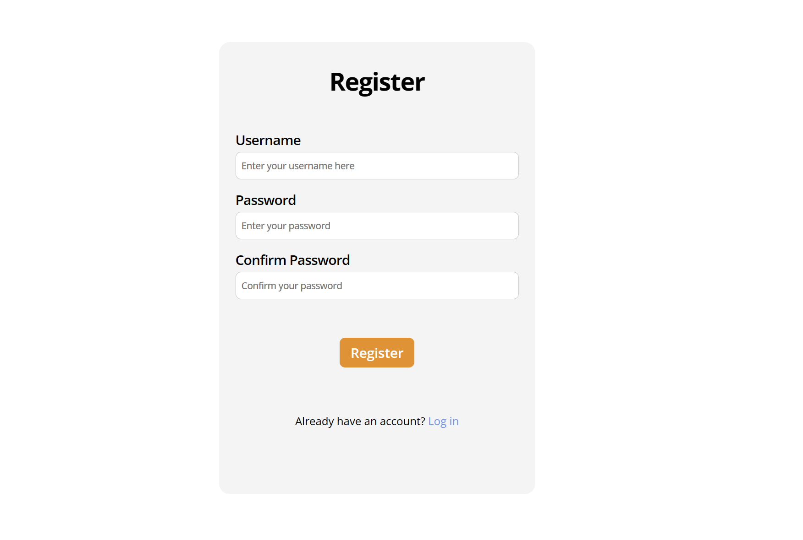

- Halaman Login
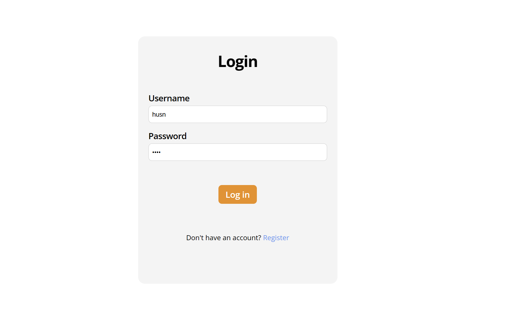

- Halaman Admin
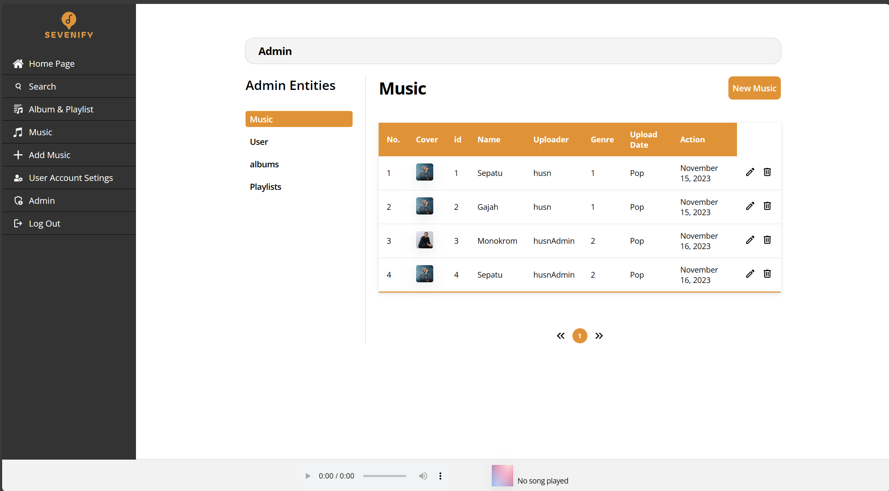

- Halaman HomePage
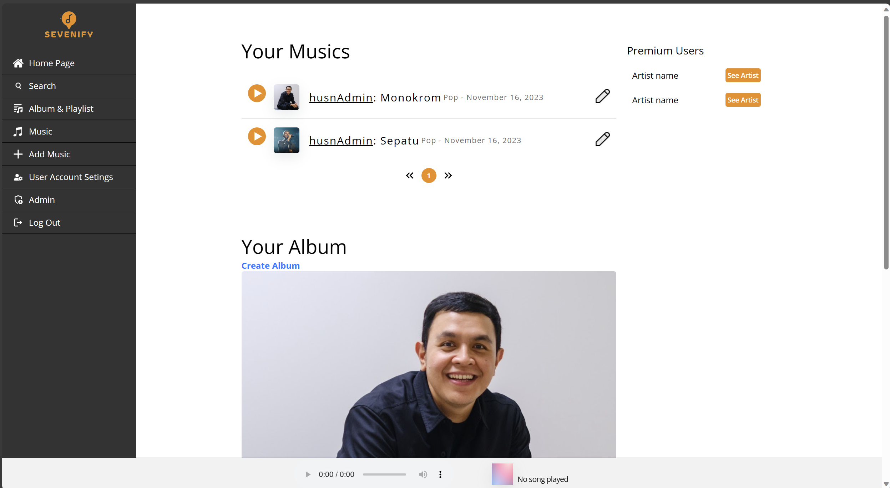

- Halaman Tambah Musik
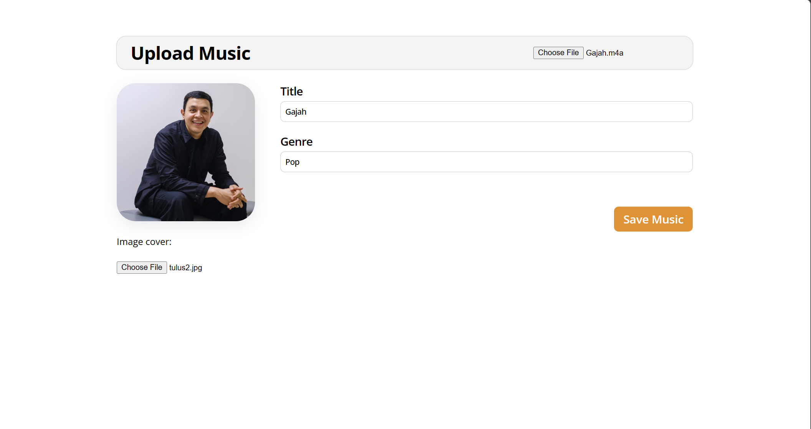

- Halaman Edit Musik
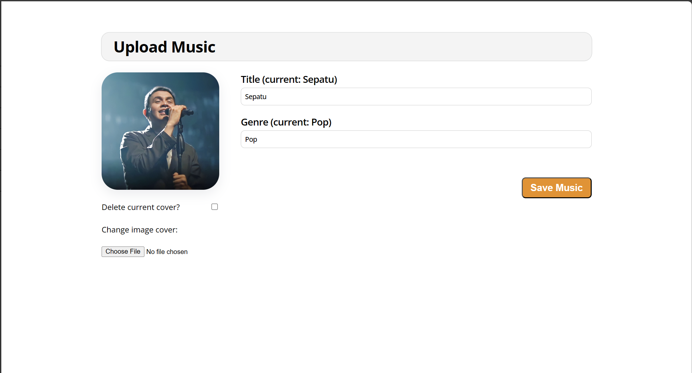

- Halaman Album
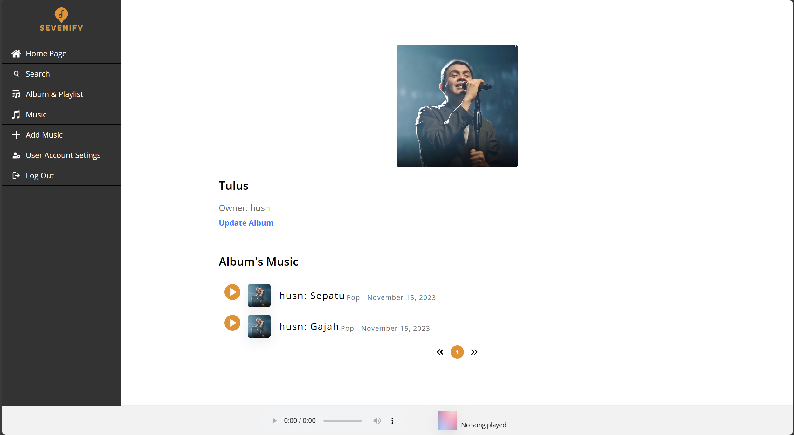

- Halaman Playlist
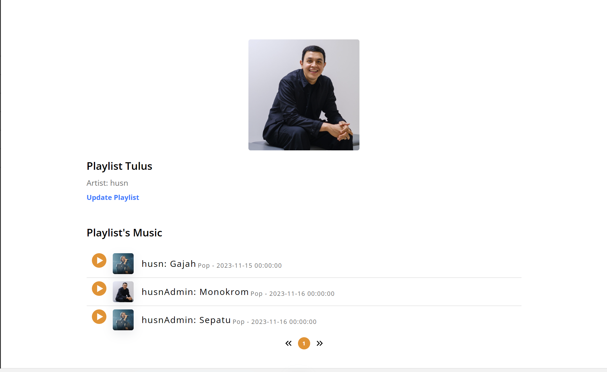

- Halaman Tambah Album
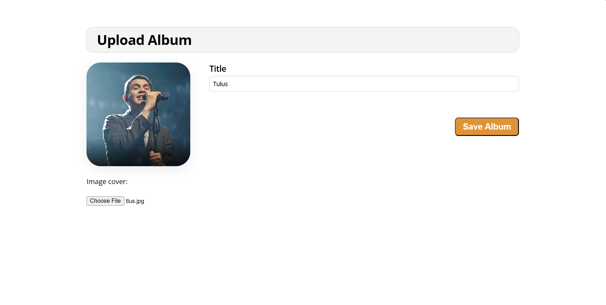

- Halaman Edit Album
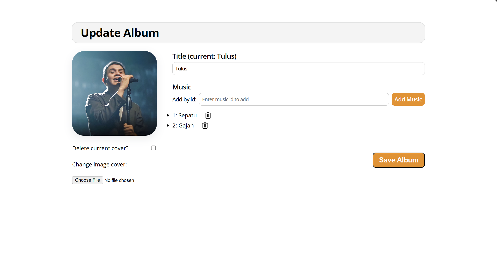

- Halaman User Setting
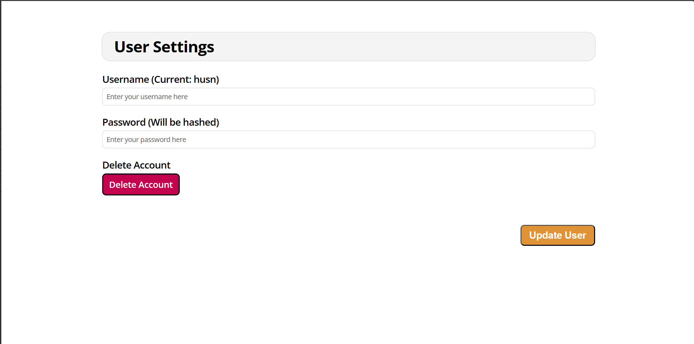

- Halaman Search
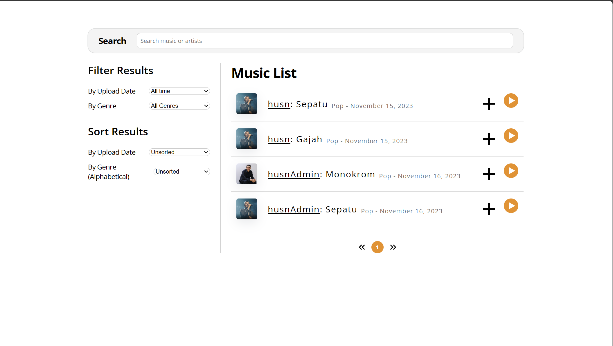

## Perubahan Implementasi
- 

## Pembagian Tugas
* Perubahan Implementasi: 13521134

* _Server Side_
    1. Login : 13521134
    2. Register : 13521134
    3. Navigation Bar : 10023174
    4. Music Player : 13521134
    5. Homepage : 13521077
    6. Album Page : 13521077, 13521134
    7. Playlist Page : 13521077, 13521134
    8. User Profile Setting : 10023174
    9. Admin Music : 13521134
    10. Admin Album : 13521134
    11. Admin Playlist : 13521134
    
* _Client Side_ 
    1. Login : 13521134
    2. Register : 13521134
    3. Navigation Bar : 10023174
    4. Music Player : 13521134
    5. Homepage : 13521077
    6. Album Page : 13521077
    7. Playlist Page : 13521077
    8. User Profile Setting : 10023174
    9. Admin Music : 13521134
    10. Admin Album : 13521134
    11. Admin Playlist : 13521134
    
## Kontributor
10023174 Ilham Syam 
13521077 Husnia Munzayana 
13521134 Rinaldy Adin 
